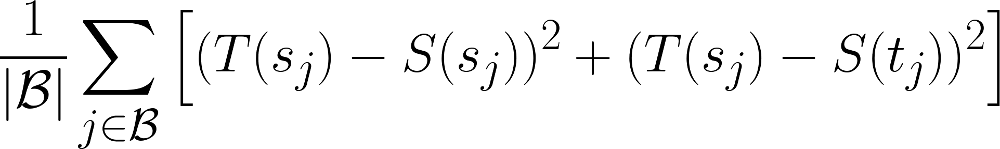

Encoding the semantics of words and sentences is something we take for granted that state-of-the art NLP systems are capable of. SentenceBERT provides illustrating examples of how we can make the best use of transformer based architectures in tasks such as clustering and semantic textual similarity. This model is however limited to processing sequences of text from a **single language**, which in some cases can be the factor preventing us from deploying such a model into production. It would therefore be interesting to figure out a way to extend these models into the realm of **multilinguality**, which is what Reimers et al. study in [Making Monolingual Sentence Embeddings Multilingual using Knowledge Distillation](https://arxiv.org/pdf/2004.09813.pdf).  This article is a summary of that research paper, where I also share my thoughts and reflections on their contribution and findings.

## Introduction
Multilingual models can produce token, and therefore in extension, sentence embeddings for multiple languages at once. While this capability extends the possible use cases, it comes with a small caveat: **There is no guarantee that vector spaces across languages are aligned**. This basically means that the same word or sentence, translated into different languages and processed by the model, could be assigned vector representations that aren’t similar nor close in the embedding space. This prevents us from performing tasks such as information retrieval, clustering and semantic textual similarity _across_ languages.

\\
However, this is not to say that such tasks are impossible to perform _within_ a single language. Semantically meaningful sentence embeddings can, and has been, generated successfully through models such as [SentenceBERT (SBERT)](https://arxiv.org/abs/1908.10084) . If you haven’t already read that paper, I recommend you to have a look at my  [paper summary which covers the motivation, implementation, related works and results achieved by the authors.](https://link.medium.com/lnaKDerqT7)  In short, SBERT is trained to generate sentence embeddings that preserve the input sequence’s semantics. This is achieved through mapping similar sentences close to each other while dissimilar ones further apart.

\\
What if we could extend this capability of assigning semantically meaningful representations to work both within and across a wider set of languages? That would open up lots of interesting use-cases. This, in fact, is exactly what Reimers et al. study in [Making Monolingual Sentence Embeddings Multilingual using Knowledge Distillation](https://arxiv.org/pdf/2004.09813.pdf) . They transfer the capabilities of SBERT to multilingual models such as [XLM-Roberta (XLM-R)](https://arxiv.org/pdf/1911.02116.pdf)  through a novel _knowledge distillation_ training process.

## Proposed knowledge distillation procedure
Knowledge distillation enables the behaviour of one model, referred to as the teacher, to be taught to another, the student. This method can in one configuration _distill_ the _knowledge_ of a large, possibly state of the art model into a much smaller one, [which can retain 95%+ of the teachers performance while reducing the number of parameters with a factor of 7](https://medium.com/dair-ai/tinybert-size-does-matter-but-how-you-train-it-can-be-more-important-a5834831fa7d) ! It can however also be used when one model has properties we would like to transfer onto another one, without necessarily reducing model size. This is more akin to what Reimers et al. focused on.

\\
They employ SBERT as the teacher (T) and use a multilingual model as its student (S). To enable the student to mimic the behaviour of the teacher requires translated (parallel) sentences from one or more source languages _(s)_ to one or more target languages _(t)_: $$[(s_1, t_1), (s_2, t_2), …, (s_N, t_N)]$$. The requirement is that the teacher can process the source language(s) _s_ while the multilingual student can deal with the target ones _t_.

\\
The knowledge distillation training objective is constructed as follows: Train the student model S so that $$S(s_i) \approx T(s_i)$$ and $$S(t_i) \approx T(s_i)$$. In other words, we want the student’s sentence representations for both languages in the pair to be close to the teacher’s embedding in the source language. This can be achieved through minimising the mean-squared loss over a mini-batch _B_:

\\

\\
A schematic overview of the training procedure therefore looks something like this.

\\
](../images/summary-making-monolingual-senence-embeddings-multilingual-using-knowledge-distillation/training-process-schematic.png)

_Note: A benefit of this procedure is that it allows training for a goal objective on high resource language to gain the sought after properties. These can then be transferred to lower resource languages where it might be more useful for the application at hand._

## Experiments
The model is evaluated in three scenarios: _Multilingual semantic textual similarity_ (mSTS), _Bitext retrieval_ and how _training data size affects performance._ Let’s go through each of these, one by one.

### Multilingual semantic textual similarity
Here, models are evaluated based on how well they encode the semantics both within and across different languages. This is enabled through a multilingual STS dataset where sentence pairs from different languages are ranked based on their similarity.
The authors compare five different systems in this task, most of which will be used in later experiments so it’s worth keeping these on top of mind.
1. Multilingual language models without specific training for aligning vector spaces across languages. Specifically Multilingual-BERT (mBERT) and XLM-Roberta (XLM-R).
2. Multilingual language models trained on English STS data. This should bias the embeddings to be close if semantically similar, at least for english. These models are referred to as mBERT-nli-stsb and XLM-R-nli-stsb.
3. LASER, an encoder-decoder LSTM trained for translation between 90+ languages. A max-pooling strategy is applied over the encoder outputs in order to generate a fixed size representation for each sequence.
4. Multilingual Universal Sentence Encoder (mUSE), a dual-encoder transformer architecture trained on SNLI data and parallel corpora over 16 languages.
5. Multilingual models trained through the proposed knowledge distillation process. Specifically mBERT, DistilmBERT and XLM-R distilled with knowledge from SBERT-nli-stsb, which will be referred to as “<multilingual model> ← SBERT-nli-stsb”

**Same-language STS evaluation**
\\
These models are first evaluated based on how well they can compare similarity between sentences from a single language at a time (see table below). What we find is that multilingual models, without STS specific training perform the worst, across all languages. This is in line with what previous work has found:

> The output from vanilla-transformer models such as BERT and RoBERTa is ill-suited for semantic comparison using cosine distance.  

The monolingual SBERT-nli-stsb, only trained on _English_ data, perform well above random when computing similarity between _Spanish_ sentences. This in and of itself is a surprising finding! For Arabic on the other hand is the performance worse which might be due to the amount of _out of vocabulary_ tokens present in Arabic. SBERT uses a [Word-piece tokenizer](https://arxiv.org/pdf/1609.08144.pdf)  which is suboptimal of multilingual tasks due to language specific assumptions that are needed during training of this tokenizer. In multilingual settings, it’s preferable to use [Sentence-piece tokenisation](https://github.com/google/sentencepiece)  which is designed to address these shortcomings.

\\
The best performance is achieved through the proposed distillation process. It especially improves on the baseline for Arabic.

\\
](../images/summary-making-monolingual-senence-embeddings-multilingual-using-knowledge-distillation/results-monolingual-sts.png)

\\
**Across language STS evaluation**
\\
The second STS task used to evaluate the models is more challenging, as it asks models to evaluate similarity of sentence pairs across languages. As apparent by the table below, most multilingual models struggle and perform significantly worse compared to the same-language STS task above. It is therefore safe to conclude that the multilingual models create meaningful representation within each language, but these vector spaces are not aligned across languages.

\\
](../images/summary-making-monolingual-senence-embeddings-multilingual-using-knowledge-distillation/results-monolingual-sts.png)

LASER performs best among the baseline algorithms with an improvement of more than 10 points. However, the multilingual knowledge-distilled models outperform it by a significant margin, again providing a 10 point increase across the board. One possible reason for why LASER cannot achieve competitive results here could be a result of how it was trained - to generate translations. This capability does not necessarily translate (no pun intended) over to comparing semantics, as two sentences do not need to be exact translations in order to be semantically equivalent.

### Bitext retrieval
This task asks the models to identify translated sentences in a large corpora of different languages, where only a small set of sentences have a translated equivalent in another language. By definition this task does not necessarily lend itself to models with the capability of finding semantically similar sentences. Translated sentences are probably assigned similar vectors, but the opposite does not hold true: just because two sentence embeddings are similar does not imply that they are translations of each other.

\\
These challenges are reflected in the results where all the multilingual transformer models struggle. The proposed knowledge distilled XLM-R significantly outperforms these baselines but is outperformed by both mUSE and LASER. From the discussion above, this is what we should expect.

\\
](../images/summary-making-monolingual-senence-embeddings-multilingual-using-knowledge-distillation/results-bucc-bitext-retrieval.png)

### Training dataset effect on performance for different languages
The final experiment performed in this paper studies the effect of training data characteristics and size on mSTS performance. This is done through training a bilingual XLM-R on a variety of datasets consisting of English-Arabic or English-German sentence pairs.
Training models in this way has an obvious advantage: It only needs to know two languages at a time, which in the results show a 1-2 point improvement compared to the multilingual models which had the capability of processing 10 languages. This effect is known as the _curse of multilinguality,_ which states that

> Adding more languages to a models training data degrades its performance if the capacity of the model remains the same.

When it comes to dataset size does the expected trend of “more data = better performance” hold true for EN-DE while not necessarily for EN-AR. Here, dataset complexity has much more impact than size. The model trained on a dataset of 27k sentence pairs significantly outperforms one trained on 8M sentence pairs!

# Conclusion
So, what have we learned? Well, we’ve seen that knowledge distillation can be used in more ways than just for compressing the knowledge of a large model into a smaller one. We also learned about the training process used to transfer the _properties_ of a model specialised in capturing sentence semantics to a multilingual model, which aligned its vector spaces across languages. This allows us to perform clustering and semantic relatedness measurements without having to worry about language, with great performance!
